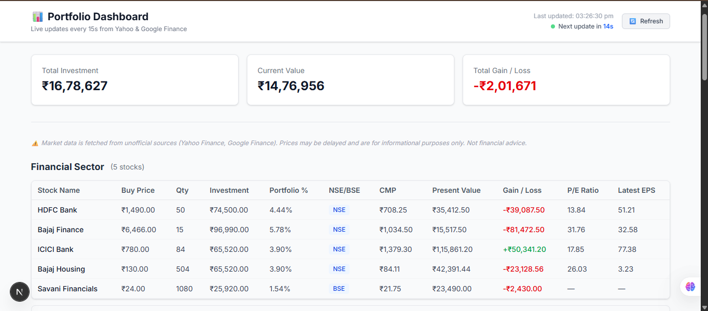
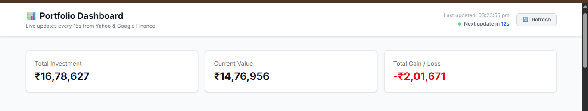
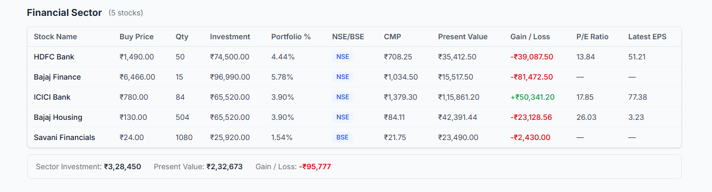
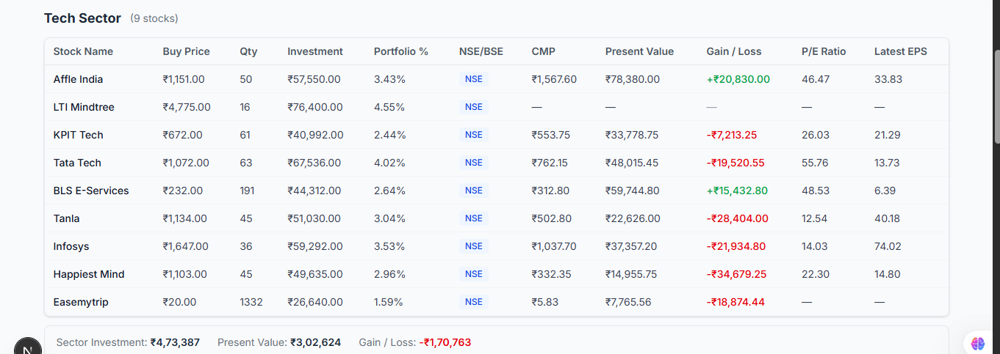
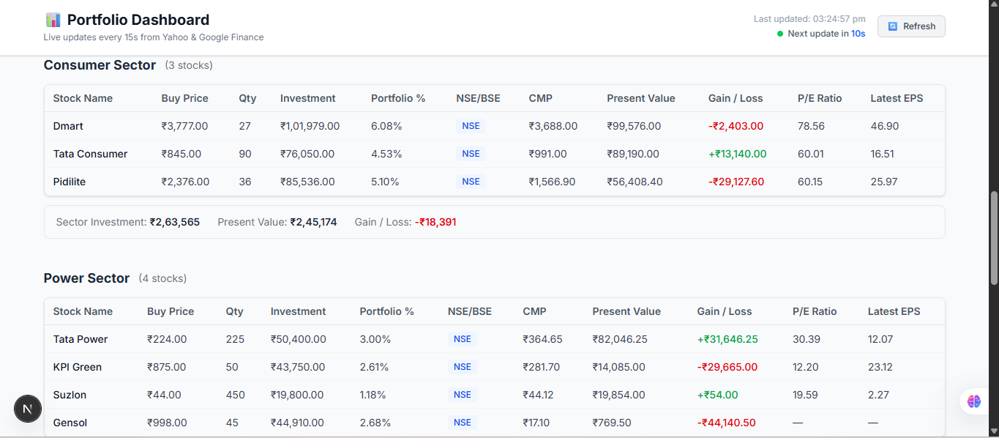
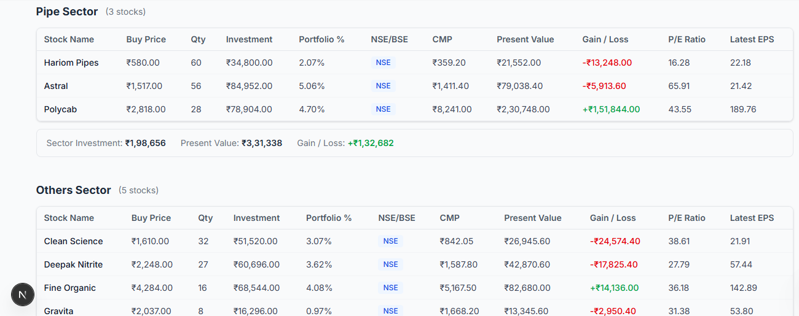
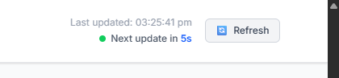

# 📊 Dynamic Stock Portfolio Dashboard

A full-stack Indian stock portfolio web application built with **Next.js (React)**, **TypeScript**, **Tailwind CSS**, and **Node.js** for the Octa Byte AI case study.

---

## 📱 System Architecture Diagram

```
+-------------------------------------------------------------------+
|                        📱 USER'S BROWSER                          |
|  - Displays Portfolio Table with 11 columns                       |
|  - Groups stocks by Sector (Financials, Tech, Consumer, etc.)     |
|  - Color codes Gain (Green) / Loss (Red)                          |
|  - Automatic 15-second countdown timer + Manual Refresh button    |
+-------------------------------------------------------------------+
                                  │
                                  │ Every 15 seconds (or on click)
                                  │ Calls GET /api/portfolio
                                  ▼
+-------------------------------------------------------------------+
|                 ⚙️ NEXT.JS BACKEND (Node.js API)                  |
|                 File: app/api/portfolio/route.ts                  |
|                                                                   |
|  1. Reads static holdings from: data/portfolio.json               |
|  2. Checks Server-Side In-Memory Cache:                           |
|     - CMP Cache: 10-second TTL                                    |
|     - P/E & EPS Cache: 5-minute TTL                               |
+-------------------------------------------------------------------+
       │                                                     │
       │ IF NOT EXPIRED (Cache Hit)                          │ IF EXPIRED (Cache Miss)
       │ Reuses prices from memory RAM (<1ms)                │ Calls external sources
       │                                                     ▼
       │                                    +---------------------------------+ +-------------------------------+
       │                                    |     📈 YAHOO FINANCE API        | |      🌐 GOOGLE FINANCE        |
       │                                    |   (via yahoo-finance2 library)  | |   (via HTML Page Scraping)    |
       │                                    |   Fetches:                      | |   Scrapes:                    |
       │                                    |   - Current Market Price (CMP)  | |   - P/E Ratio                 |
       │                                    |     (e.g., HDFCBANK.NS)         | |   - Latest Earnings (EPS)     |
       │                                    +---------------------------------+ +-------------------------------+
       │                                                     │                                   │
       │                                                     └─────────────────┬─────────────────┘
       │                                                                       │ Updates Cache
       │◄──────────────────────────────────────────────────────────────────────┘
       ▼
+-------------------------------------------------------------------+
|               🧮 FINANCIAL CALCULATION ENGINE                     |
|                   File: lib/calculations.ts                       |
|                                                                   |
|   • Investment    = Purchase Price × Quantity                     |
|   • Present Value = CMP × Quantity                                |
|   • Gain / Loss   = Present Value - Investment                    |
|   • Portfolio %   = (Stock Investment ÷ Total Investment) × 100   |
|   • Sector Totals = Sum of (Investment, Value, Gain/Loss)         |
+-------------------------------------------------------------------+
                                   │
                                   │ Returns JSON payload
                                   ▼
                 📱 BROWSER SCREEN RE-RENDERS LIVE
```

---

## 📸 Application Screenshots

### 1. Portfolio Overview & Top Summary Cards
> Displays total portfolio investment, current value, overall gain/loss, and live market indicator.





### 2. Sector Grouping & Tabular Stock Breakdown
> Stocks grouped by sector with all 11 required columns (Buy Price, Qty, Investment, Weight %, CMP, Present Value, Gain/Loss, P/E, EPS) and sector-level summary totals.

#### Financial Sector:


#### Tech Sector:


#### Consumer & Power Sectors:


#### Pipe & Other Sectors:


### 3. Dynamic 15-Second Auto-Refresh & Status Indicator
> Demonstrates the live 15-second countdown timer, market status, and manual refresh button.



---

## 🎯 Case Study Requirements & Our Strategies

### 1. Data Sources Strategy
* **Current Market Price (CMP):**
  - **Source:** Yahoo Finance using the unofficial `yahoo-finance2` package.
  - **Symbol Mapping:** Appends `.NS` for National Stock Exchange (e.g. `TCS.NS`) and `.BO` for Bombay Stock Exchange (e.g. `532174.BO`).
* **P/E Ratio & Latest Earnings (EPS):**
  - **Source:** Google Finance (`https://www.google.com/finance/quote/SYMBOL:NSE`).
  - **Strategy:** Fetched via server-side HTTP scraping with browser headers and parsed using targeted regular expressions.
* **Why Unofficial/Scraping?**
  - Neither Yahoo Finance nor Google Finance provides free, official public REST APIs for Indian equities. We acknowledged this constraint and implemented robust error handling (`try/catch`) so that if a scrape fails for any stock, it returns `null` (displayed as `—`) without crashing the application.

---

### 2. Dynamic Updates (Every 15 Seconds)
* **Requirement:** CMP, Present Value, and Gain/Loss must update automatically at regular intervals (every 15 seconds).
* **Strategy:**
  - In `app/page.tsx`, we use a React `useEffect` hook with `setInterval(..., 15000)`.
  - Every 15 seconds, the browser requests fresh data from `GET /api/portfolio`.
  - The UI provides **visible countdown feedback** (`Next update in 14s... 13s...`), an animated **"Live / Updating"** badge, and a **"Last updated: HH:MM:SS"** timestamp.
  - A manual **`🔄 Refresh`** button allows instant on-demand updates.
  - When the component unmounts, `clearInterval` is called to prevent memory leaks.

---

### 3. Rate-Limiting & Caching Strategy
* **Requirement:** Public sources may have rate limits. Use caching, throttling, or batching to prevent blocks.
* **Strategy:**
  - **10-Second Cache for Yahoo Finance:** Ensures every 15-second client poll gets fresh market prices, while protecting against rapid page reloads (F5 spam) or multiple users opening tabs at once.
  - **5-Minute Cache for Google Finance:** Fundamental data (P/E ratio and quarterly EPS) only changes every 90 days. Caching it for 5 minutes cuts scraping requests to Google by 95%, completely avoiding bot detection/captchas.
  - **Batching with `Promise.allSettled`:** All 26 stock requests run in parallel batches on the server, completing in ~1.5 seconds instead of making 26 slow sequential requests.

---

### 4. Financial Calculations & Data Transformation
All raw data from the Excel portfolio (`portfolio.json`) is processed and transformed on the backend before reaching the client:

| Metric | Formula |
|---|---|
| **Investment** | $\text{Purchase Price} \times \text{Quantity}$ |
| **Present Value** | $\text{CMP} \times \text{Quantity}$ |
| **Gain / Loss** | $\text{Present Value} - \text{Investment}$ |
| **Portfolio Weight (%)** | $\left(\frac{\text{Stock Investment}}{\text{Total Portfolio Investment}}\right) \times 100$ |
| **Sector Summaries** | Aggregated Total Investment, Present Value, and Gain/Loss for each Sector |

All numbers are formatted cleanly into Indian Rupees (`₹ 1,50,000.00`) with standard Indian numbering (`en-IN`).

---

### 5. Sector Grouping & Visual Indicators
* Stocks are grouped by sector: **Financial, Tech, Consumer, Power, Pipe, Others**.
* Each sector displays a header, an 11-column data table, and a dedicated **Sector Summary Bar** (Total Investment, Total Present Value, Sector Gain/Loss).
* **Color Coding:**
  - 🟢 **Green** (`text-green-600`) for profits/gains ($\ge 0$).
  - 🔴 **Red** (`text-red-600`) for losses ($< 0$).

---

### 6. Live Market Hours Note
* **Trading Hours:** Indian markets (NSE & BSE) trade **Monday to Friday, 9:15 AM to 3:30 PM IST**.
* **Outside Trading Hours (Weekends & Evenings):**
  - Yahoo Finance returns Friday's **last closing price**.
  - During non-trading hours, the 15-second background refresh continues to fetch data from Yahoo Finance, and the prices remain steady at the market close value until the next trading session opens.
  - The dashboard displays a clear status banner indicating whether Indian markets are currently OPEN or CLOSED.

---

## 🚀 How to Run the Application Locally

### Prerequisites
* **Node.js** (v18.0.0 or higher) installed on your machine.

### Installation & Launch

```bash
# 1. Navigate to the project directory
cd portfolio-dashboard

# 2. Install dependencies
npm install

# 3. Start the Next.js development server
npm run dev
```

Open your browser and visit:  
👉 **[http://localhost:3000](http://localhost:3000)**

---

## 📂 Project Directory Structure

```
portfolio-dashboard/
├── app/
│   ├── layout.tsx              — Root HTML layout & fonts
│   ├── page.tsx                — Main Dashboard (Live countdown, refresh button, market banner)
│   ├── globals.css             — Tailwind CSS styling
│   ├── api/
│   │   └── portfolio/
│   │       └── route.ts        — GET /api/portfolio (orchestrates fetches & calculations)
│   └── components/
│       ├── SummaryCards.tsx    — Top portfolio summary cards
│       ├── SectorSection.tsx   — Sector headers, summaries, and table wrapper
│       └── PortfolioTable.tsx  — 11-column stock table with INR formatting
├── lib/
│   ├── portfolioData.ts        — Loads data from data/portfolio.json
│   ├── yahooFinance.ts         — Yahoo Finance API caller with 10s rate-limit cache
│   ├── googleFinance.ts        — Google Finance HTML scraper with 5m cache
│   └── calculations.ts        — Pure financial math functions
├── data/
│   └── portfolio.json          — Extracted portfolio holdings (from Excel)
├── types/
│   └── portfolio.ts            — TypeScript interfaces
└── README.md                   — This file
```
